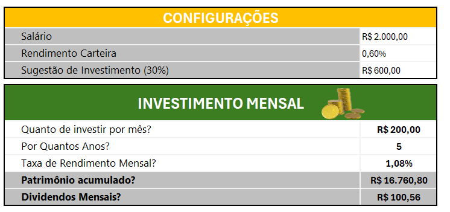
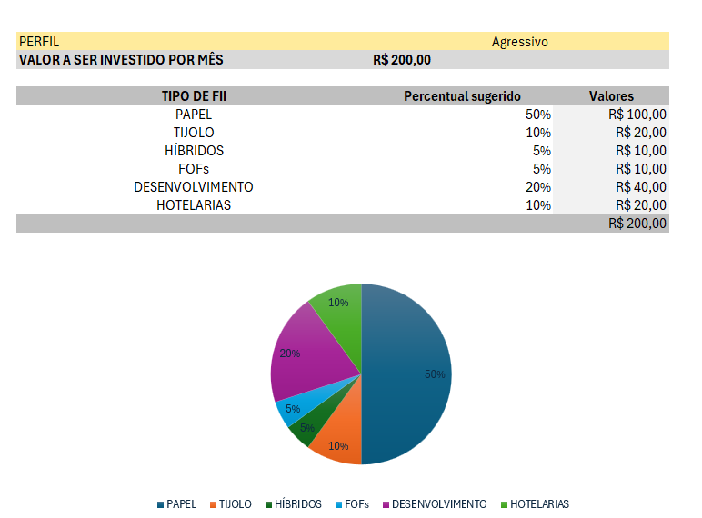

# 📊 Simulador de Investimentos em FIIs - Dashboard Premium

Projeto desenvolvido para simulação de investimentos em Fundos Imobiliários (FIIs),
utilizando Excel com estrutura profissional, variáveis globais nomeadas e PROCV.

---

## 🖼️ Preview do Projeto

### 📌 Dashboard Principal

### 📌 Perfil de investidor

---

## 🚀 Funcionalidades

- Cálculo de patrimônio futuro com juros compostos (VF)
- Simulação de dividendos mensais
- Percentual de investimento baseado no salário
- PROCV com chave composta (perfil & tipo)
- Dashboard visual Preto + Dourado (premium)
- Estrutura organizada e escalável

---

## 🎯 Objetivo

Demonstrar domínio em:
- Excel avançado
- Modelagem financeira
- Organização de variáveis globais
- Construção de dashboards profissionais
- Estruturação de projeto para GitHub

---

## 👤 Autor

Ricardo Aamisterdan  
Ano: 2026
